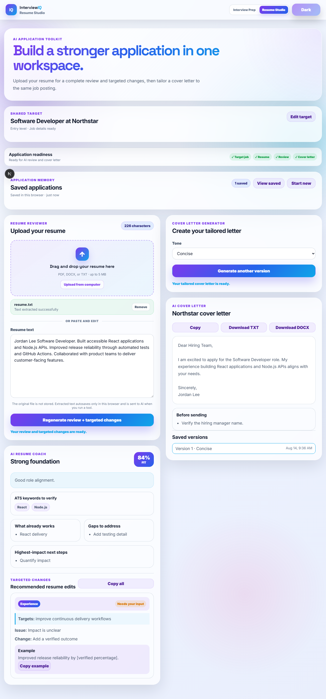
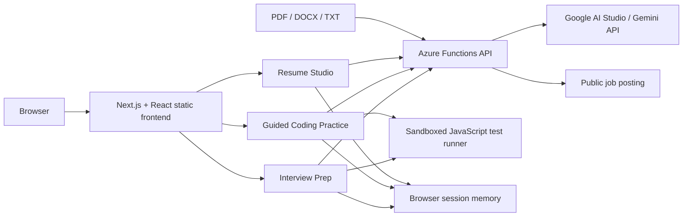

# InterviewIQ Live Demo

[](https://wonderful-ocean-0c82eb910.7.azurestaticapps.net)
[](https://nextjs.org/)
[](https://azure.microsoft.com/products/functions)
[](https://aistudio.google.com/)

InterviewIQ is a production-deployed AI career preparation application. It
analyzes a job description, generates fresh questions calibrated to the role and
seniority level, evaluates typed or spoken answers, and provides structured,
actionable coaching. A guided Coding Practice workspace teaches candidates how
to reason from prompt to tested solution. Its Resume Studio also reviews resumes, recommends
job-specific improvements, and generates grounded, one-page cover letters with
Times New Roman 12-point DOCX export.

**[Launch the live application](https://wonderful-ocean-0c82eb910.7.azurestaticapps.net)**



> This repository contains the public, serverless portfolio demo. The separate
> [InterviewIQ Lab](https://github.com/BIngram17/InterviewIQ) contains the
> original React, FastAPI, SQLite, SQLAlchemy, and local Ollama implementation.

## Highlights

- Generates six live behavioral, technical, and coding questions from the job
  title, description, interview type, company, and role level
- Supports internship, entry-level, mid-level, and senior interview calibration
- Imports public job-posting URLs and uses AI to prefill the title, company,
  role level, and description
- Produces fresh question sets when an interview is regenerated
- Scores answers and returns strengths, improvement areas, coaching notes, and
  an improved response
- Records voice answers in the browser and supports speech-to-text where the
  browser provides the Web Speech API
- Provides a dedicated, AI-generated Coding Practice workspace for JavaScript,
  Python, Java, C#, and Rust
- Guides learners through understanding the prompt, identifying edge cases,
  planning, pseudocode, implementation, testing, complexity, and final review,
  with visible progress and free movement among unlocked steps
- Requires candidates to pass every executed test before later workflow steps
  unlock, then provides code- and test-aware AI debugging support after three
  unsuccessful runs
- Saves up to 24 coding challenges in device-local browser storage, including
  reasoning notes, code, tests, coaching, progress, and
  final reviews, with restore and confirmed delete controls
- Automatically migrates compatible challenges saved before the five-language
  runner was introduced by inferring their test input and output contracts
- Runs JavaScript inside a restricted browser iframe and executes Python, Java,
  C#, and Rust through the free Wandbox sandbox behind the rate-limited Azure API
- Provides IDE-style coding controls with Tab/Shift+Tab indentation, automatic
  indentation on Enter, and closing-brace outdent behavior
- Saves interview sessions and session-scoped answer attempts in browser storage
- Tracks application readiness and autosaves named drafts, extracted resume
  text, reviews, targeted edits, and versioned cover letters in device-local
  storage for up to 24 applications with restore, rename, confirmed delete,
  and undo controls
- Gives every Copy action an immediate copied/failed status and includes
  downloadable text feedback reports
- Provides responsive light and dark themes
- Includes a dedicated Resume Studio for role-fit reviews, targeted resume
  changes linked to job requirements, ATS keyword guidance, and grounded cover
  letters with professional, concise, and conversational tones
- Distinguishes safe rewrites from recommendations that require candidate input,
  with per-change and bulk-copy controls; every edit identifies whether to add,
  replace, or move content and names its exact resume placement
- Grounds rewrites in exact resume evidence, rejects abbreviated recommendations,
  preserves all existing skills, and treats job-posting-only skills as unconfirmed
- Stores an optional Candidate Profile of user-confirmed skills, experience,
  achievements, education, certifications, and contact details in device-local
  browser storage with edit, export, and clear controls
- Uses a transparent 100-point job-fit rubric, projected improvement score, and
  prioritized edits with estimated point impact to show the strongest path to a
  90%+ match without inventing qualifications
- Exports cover letters as TXT or DOCX and preserves up to ten generated versions
- Provides a persistent Interview Prep / Resume Studio switcher on desktop and mobile
- Accepts drag-and-drop PDF, DOCX, and TXT resumes and extracts their text
  without permanently storing the uploaded file
- Runs Playwright end-to-end tests for the tailored application flow, local
  memory, and mobile navigation before Azure deployment

## Architecture



The frontend is statically exported by Next.js and hosted through Azure Static
Web Apps. AI requests are sent to managed Azure Functions so the Gemini API
credential never enters client-side code.

### API routes

| Route | Purpose |
| --- | --- |
| `POST /api/interview` | Analyze the role and generate a fresh interview set |
| `POST /api/feedback` | Score and coach a behavioral or technical answer |
| `POST /api/coding-challenge` | Generate a language-, difficulty-, and topic-specific coding challenge |
| `POST /api/coding-coach` | Coach the learner at one reasoning or implementation stage |
| `POST /api/code-runner` | Execute bounded Python, Java, C#, or Rust test cases in a server-routed sandbox |
| `POST /api/code-feedback` | Review JavaScript, Python, Java, C#, or Rust code as text |
| `POST /api/job-import` | Safely fetch a public posting and extract structured job details |
| `POST /api/resume-extract` | Extract bounded plain text from an uploaded PDF, DOCX, or TXT resume |
| `POST /api/resume-tools` | Review resumes, suggest edits, or generate a grounded cover letter |

## Security Design

This demo treats job descriptions, answers, and source code as untrusted data.
Its defensive controls include:

- Server-side model credentials stored in Azure application settings
- Explicit prompt boundaries that prevent user data from becoming system
  instructions
- Length limits, control-character removal, input validation, and normalized
  structured outputs
- Request-size limits, AI timeouts, and basic per-IP request throttling
- Content Security Policy and restrictive browser security headers
- Sandboxed JavaScript execution in a dedicated iframe with network access
  disabled
- Code review prompts that treat submitted source code as inert text
- Public-job URL validation, redirect revalidation, response-size limits, and
  local/private network blocking to reduce server-side request forgery risk
- Resume file type, signature, and 5 MB size validation before text extraction

These controls reduce prompt-injection and code-execution risk, but they are not
presented as a guarantee against every possible attack.

## Technology

| Layer | Technologies |
| --- | --- |
| Frontend | Next.js 16, React 19, TypeScript, CSS, DOCX generation |
| API | Node.js 22, Azure Functions |
| AI | Google AI Studio / Gemini API, `gemini-3.6-flash` by default |
| Hosting | Azure Static Web Apps |
| Browser APIs | MediaRecorder, Web Speech, Clipboard, Blob |
| Security | CSP, iframe sandboxing, input validation, prompt boundaries, SSRF safeguards |
| Testing and CI/CD | Playwright, ESLint, GitHub Actions |

## Run Locally

### Prerequisites

- Node.js 22 or newer
- A Gemini API key from Google AI Studio

`gemini-3.6-flash` is available on the Gemini API free tier, subject to
[Google's current quotas and pricing](https://ai.google.dev/gemini-api/docs/pricing).
Free-tier request content may be used to improve Google's products; use a paid
tier if that data policy is not appropriate for your deployment.

Install dependencies:

```bash
npm install
npm --prefix api install
```

Create `api/local.settings.json` for local Azure Functions development:

```json
{
  "IsEncrypted": false,
  "Values": {
    "AzureWebJobsStorage": "",
    "FUNCTIONS_WORKER_RUNTIME": "node",
    "GEMINI_API_KEY": "your-key",
    "GEMINI_MODEL": "gemini-3.6-flash"
  }
}
```

Never commit `local.settings.json` or a real token.

For frontend-only development:

```bash
npm run dev
```

Run linting and the desktop/mobile browser suite:

```bash
npm run lint
npx playwright install chromium
npm run test:e2e
```

For the complete static frontend and managed API:

```bash
npm run build
npx @azure/static-web-apps-cli start out --api-location api
```

Open the local URL printed by the Static Web Apps CLI.

## Production Deployment

Build the static frontend:

```bash
npm run build
```

The frontend is exported to `out/`. Deploy it with the Azure Functions API:

```bash
npx @azure/static-web-apps-cli deploy out --api-location api --env production
```

Configure these Azure Static Web Apps environment variables:

```text
GEMINI_API_KEY
GEMINI_MODEL
GEMINI_FALLBACK_MODEL
GEMINI_ATTEMPT_TIMEOUT_MS
GEMINI_TOTAL_TIMEOUT_MS
```

`GEMINI_MODEL` is optional and defaults to `gemini-3.6-flash`.
`GEMINI_FALLBACK_MODEL` is optional and defaults to
`gemini-3.5-flash-lite`. Transient provider failures are retried with bounded
exponential backoff. A stalled primary request is aborted independently so the
fallback model receives a fresh request budget instead of inheriting an expired
signal. The optional attempt and total timeout settings default to 17 and 50
seconds respectively. Gemini thinking is set to `low` for these latency-sensitive
structured JSON operations so reasoning does not consume the response budget.

## Project Structure

```text
interviewiq-live-demo/
|-- api/
|   |-- src/functions/       # Interview, resume, answer, and code endpoints
|   `-- src/lib/ai.js        # Gemini API client and API safeguards
|-- app/
|   |-- coding/              # Guided five-language problem-solving workspace
|   |-- components/          # Shared importer, navigation, and copy controls
|   |-- resume/              # Resume review and cover-letter workspace
|   |-- page.tsx             # Interview workflow and client state
|   |-- globals.css          # Responsive light/dark product interface
|   `-- layout.tsx           # Metadata and social preview configuration
|-- public/
|   |-- code-runner.html     # Restricted JavaScript runner frame
|   |-- code-runner.js
|   |-- resume-studio.png    # Browser-tested product screenshot
|   `-- staticwebapp.config.json
|-- e2e/                     # Playwright desktop and mobile flows
|-- playwright.config.ts
`-- README.md
```

## Demo Data and Limitations

- Interview, application, and coding-practice sessions are stored in the current
  browser, not a hosted database or user account.
- The public demo does not require an account.
- Recorded audio remains in the browser and is not uploaded to the API.
- JavaScript runs in the browser sandbox; Python, Java, C#, and Rust execution
  depends on Wandbox, a free third-party service with per-IP limits and no SLA.
- AI availability and limits depend on the Gemini API and the configured model.
- The public demo's rate limiter is instance-local and does not replace a
  provider-side budget or quota cap.
- Job URL import works only for public HTML pages; sites that block automated
  access require the user to paste the job description manually.
- Image-only or heavily formatted PDFs may not contain enough readable text;
  DOCX or pasted text is the recommended fallback.

## Related Project

The [InterviewIQ Lab](https://github.com/BIngram17/InterviewIQ) demonstrates a
different full-stack architecture with React, Vite, FastAPI, SQLAlchemy, SQLite,
and a locally hosted Ollama model. Keeping the two repositories separate makes
the local product work and the publicly deployed serverless demo independently
understandable.

## License

Released under the [MIT License](LICENSE).
