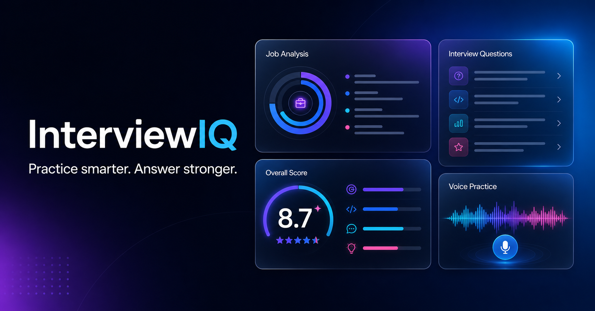
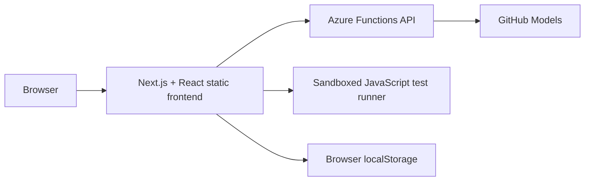

# InterviewIQ Live Demo

[](https://wonderful-ocean-0c82eb910.7.azurestaticapps.net)
[](https://nextjs.org/)
[](https://azure.microsoft.com/products/functions)
[](https://github.com/marketplace/models)

InterviewIQ is a production-deployed AI interview coaching application. It
analyzes a job description, generates fresh questions calibrated to the role and
seniority level, evaluates typed or spoken answers, and provides structured,
actionable coaching.

**[Launch the live application](https://wonderful-ocean-0c82eb910.7.azurestaticapps.net)**



> This repository contains the public, serverless portfolio demo. The separate
> [InterviewIQ Lab](https://github.com/BIngram17/InterviewIQ) contains the
> original React, FastAPI, SQLite, SQLAlchemy, and local Ollama implementation.

## Highlights

- Generates six live behavioral, technical, and coding questions from the job
  title, description, interview type, company, and role level
- Supports internship, entry-level, mid-level, and senior interview calibration
- Produces fresh question sets when an interview is regenerated
- Scores answers and returns strengths, improvement areas, coaching notes, and
  an improved response
- Records voice answers in the browser and supports speech-to-text where the
  browser provides the Web Speech API
- Provides a coding workspace for JavaScript, Python, and Java
- Runs JavaScript tests inside a restricted browser iframe and automatically
  sends the result to the AI coding coach
- Reviews Python and Java solutions as inert text without executing them
- Saves interview sessions and session-scoped answer attempts in browser storage
- Includes copy and downloadable text feedback reports
- Provides responsive light and dark themes

## Architecture



The frontend is statically exported by Next.js and hosted through Azure Static
Web Apps. AI requests are sent to managed Azure Functions so the GitHub Models
credential never enters client-side code.

### API routes

| Route | Purpose |
| --- | --- |
| `POST /api/interview` | Analyze the role and generate a fresh interview set |
| `POST /api/feedback` | Score and coach a behavioral or technical answer |
| `POST /api/code-feedback` | Review JavaScript, Python, or Java code as text |

## Security Design

This demo treats job descriptions, answers, and source code as untrusted data.
Its defensive controls include:

- Server-side model credentials stored in Azure application settings
- Explicit prompt boundaries that prevent user data from becoming system
  instructions
- Length limits, control-character removal, input validation, and normalized
  structured outputs
- Request-size limits, AI timeouts, and basic per-IP request throttling
- Content Security Policy and restrictive browser security headers
- Sandboxed JavaScript execution in a dedicated iframe with network access
  disabled
- Code review prompts that treat submitted source code as inert text

These controls reduce prompt-injection and code-execution risk, but they are not
presented as a guarantee against every possible attack.

## Technology

| Layer | Technologies |
| --- | --- |
| Frontend | Next.js 16, React 19, TypeScript, CSS |
| API | Node.js 22, Azure Functions |
| AI | GitHub Models, `openai/gpt-4.1-mini` by default |
| Hosting | Azure Static Web Apps |
| Browser APIs | MediaRecorder, Web Speech, Clipboard, Blob |
| Security | CSP, iframe sandboxing, input validation, prompt boundaries |

## Run Locally

### Prerequisites

- Node.js 22 or newer
- A GitHub token with permission to use GitHub Models

Install dependencies:

```bash
npm install
npm --prefix api install
```

Create `api/local.settings.json` for local Azure Functions development:

```json
{
  "IsEncrypted": false,
  "Values": {
    "AzureWebJobsStorage": "",
    "FUNCTIONS_WORKER_RUNTIME": "node",
    "GITHUB_MODELS_TOKEN": "your-token",
    "GITHUB_MODELS_MODEL": "openai/gpt-4.1-mini"
  }
}
```

Never commit `local.settings.json` or a real token.

For frontend-only development:

```bash
npm run dev
```

For the complete static frontend and managed API:

```bash
npm run build
npx @azure/static-web-apps-cli start out --api-location api
```

Open the local URL printed by the Static Web Apps CLI.

## Production Deployment

Build the static frontend:

```bash
npm run build
```

The frontend is exported to `out/`. Deploy it with the Azure Functions API:

```bash
npx @azure/static-web-apps-cli deploy out --api-location api --env production
```

Configure these Azure Static Web Apps environment variables:

```text
GITHUB_MODELS_TOKEN
GITHUB_MODELS_MODEL
```

`GITHUB_MODELS_MODEL` is optional and defaults to
`openai/gpt-4.1-mini`.

## Project Structure

```text
interviewiq-live-demo/
|-- api/
|   |-- src/functions/       # Interview, answer, and code feedback endpoints
|   `-- src/lib/ai.js        # GitHub Models client and API safeguards
|-- app/
|   |-- page.tsx             # Interview workflow and client state
|   |-- globals.css          # Responsive light/dark product interface
|   `-- layout.tsx           # Metadata and social preview configuration
|-- public/
|   |-- code-runner.html     # Restricted JavaScript runner frame
|   |-- code-runner.js
|   `-- staticwebapp.config.json
`-- README.md
```

## Demo Data and Limitations

- Interview sessions are stored in the current browser, not a hosted database.
- The public demo does not require an account.
- Recorded audio remains in the browser and is not uploaded to the API.
- JavaScript is the only language executed by the built-in test runner.
- Python and Java receive AI review without server-side execution.
- AI availability and limits depend on GitHub Models and the configured model.

## Related Project

The [InterviewIQ Lab](https://github.com/BIngram17/InterviewIQ) demonstrates a
different full-stack architecture with React, Vite, FastAPI, SQLAlchemy, SQLite,
and a locally hosted Ollama model. Keeping the two repositories separate makes
the local product work and the publicly deployed serverless demo independently
understandable.

## License

Released under the [MIT License](LICENSE).
